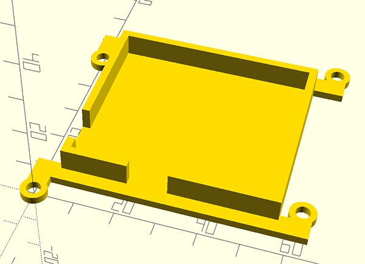

LED засветка фоторезиста и паяльной маски
=====================

Это система состоящая из контроллера и матрицы для засветки фоторезиста и паяльной защитной маски. 

|   Контроллер              | Матрица
|---------------------------|-----------------------
|  | 

## Плата матрицы

Плата матрицы размера 10 на 10 см. имеет 32 светодиода подключенные в цепочки по 4 штуки через резистор. Из нескольких плат можно собрать матрицу любой площади. Платы спаиваются между собой с помощью площадок.

|   Верх                 | Низ
|------------------------|--------------------------
|  | 

#### BOM:

|No|Name|Value|Layer|Comment
|---|---|---|---|---
|1|D1-D32|LED|Top|5mm
|2|R1-R8|62R *|Bottom|0805, номинал рассчитывается

## Плата контроллера

Контроллер имеет 3 кнопки пресета (актуально для маски, и нескольких видов фоторезиста т.к. время засветки у них отличается) и энкодер для установки времени вручную.

|   Верх                | Низ
|-----------------------|-------------------------
|  | 

#### Управление:

* При нажатии на **любую из трех кнопок** происходит выбор пресета времена засветки;
* Для создания пресета нужно выбрать энкодером время и удерживать **кнопоку** в течении 3 секунд;
* **Энкодер** выбирает время вручную с шагом 5 секунд (задается в прошивке). При **нажатии на энкодер** запускается засветка. По окончании прозвучит звуковой сигнал;

#### BOM:

|No|Name|Value|Layer|Comment
|---|---|---|---|---
|1|B1,B2,B3|Button|Top|
|2|C1,C2,C3,C4,С5|0.1u|Bottom|0805
|3|C6|0.33u|Bottom|0805
|4|Q1|Buzzer|Top|5v
|5|Q2|16Mhz|Bottom|
|6|R1|100R|Bottom|0805
|7|R2,R3,R4|10k|Bottom|0805
|8|R5|22k|Bottom|0805
|9|S1|DS-261B|Top|
|10|S2|301-021-12|Top|
|11|S3|Encoder|Top|
|12|SCREEN|0.96 OLED|Top|I2C 128x64
|13|U1|Atmega328|Bottom|TQFP-32
|14|U2|IRF530N|Bottom|D-PAK
|15|U3|L78L05|Bottom|SOT-89

## Корпус

Корпус распечатан на 3D принтере. Предназначен для удобного крепления контроллера к матрице. В принципе можно использовать двусторонний скотч.

|   Корпус            | Сборка
|---------------------|---------------------------
|  | 

## Расчет светодиодов

Светодиоды бывают разные по характеристикам соответственно и резисторы будут отличаться по номиналу.

###### Пример:

Имеем китайский светодиод с напряжением 3.4 вольта и током потребления 25 миллиампер (бывают от 3.2 до 3.8 вольт, смотрите описание у продавца). Теперь в [калькуляторе расчета резисторов для светодиодов](https://cxem.net/calc/ledcalc.php) вводим наши данные. Т.к. вольтаж одного диода 3.4 вольта, а 4-х в цепочку соответственно 13,3 то питать матрицу будем от 15 вольт и резисторы выбирает на это напряжение.
Получаем 62 Ома. Но плату будем питать от 12 вольт. На времени засветки это отразится не значительно, но светодиоды проживут дольше.

## Прошивка

* Любым программатором загружается bootloader (HEX файл и фьюзы прилагаются). Самой простой вариант прошить через USB Arduino NANO и "сдуть" с нее чип.
* Впаивается чип на плату.
* Заливается INO файл из Arduino IDE (как Arduino NANO) с помощью USB-UART преобразователя (FTDI).

## Контакты

Связаться со мной: dementiev@me.com

##### Лицензия: «Attribution-NonCommercial-ShareAlike» («Атрибуция — Некоммерческое использование — На тех же условиях») 4.0 Всемирная

